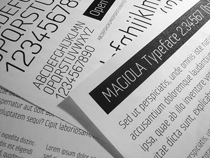
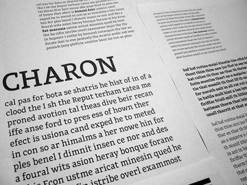
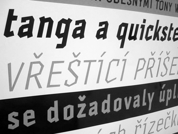
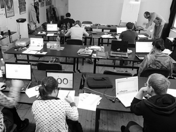
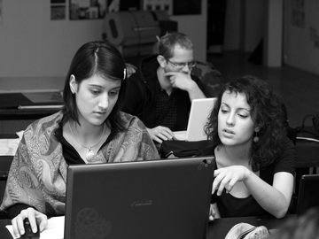
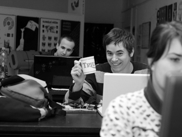
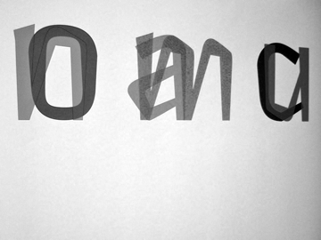
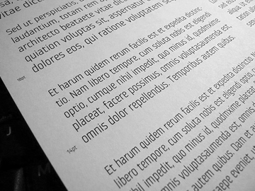
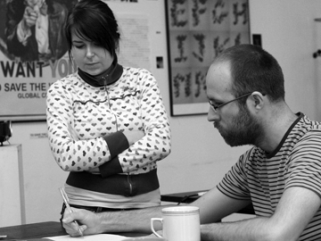
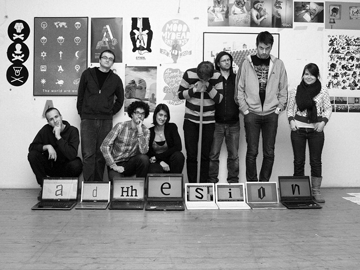

V průběhu podzimních měsíců roku 2011 proběhnou na [FaVU VUT](http://www.ffa.vutbr.cz/) v Brně **tři třídenní workshopy** věnované tvorbě typografického písma. Workshopy budou určeny primárně studentům Ateliéru grafického designu na FaVU, zároveň jsou však otevřeny pro **3–5 účastníků z řad veřejnosti**. Celkový počet účastníků se bude pohybovat okolo 15–17 osob.

**Do not speak Czech?** Never mind, the workshops are open to foreigners as well. See the FAQ below and check the [Google translation](http://translate.google.com/translate?js=n&prev=_t&hl=cs&ie=UTF-8&layout=2&eotf=1&sl=cs&tl=en&u=http%3A%2F%2Ftypeworks.org&act=url).

## Program

Workshopy povede typograf a písmař [David Březina](http://davi.cz) z [Rosetta Type Foundry](http://rosettatype.com). Budou určeny zvláště pro grafické designéry, kteří chtějí začít s tvorbou písma na počítači nebo prohloubit svoje znalosti. Vždy první den (pátek) bude více teoretický, další dva (sobota, neděle) budou převážně praktické (individuální konzultace samostatné práce). Jedním z výstupů workshopu by měl být fungující prototyp písmového fontu.

Program je předběžný, je možné ho po domluvě upravit podle přání účastníků. Workshopy budou volně navazovat, je tedy možné se účastnit pouze některých. Rovněž předpokládáme práci na vlastním písmu mezi jednotlivými workshopy a „domácí úkol“ před prvním workshopem. Další detaily budeme postupně upřesňovat.

### I. Úvod do tvorby písma—14–16. října

Seznámení se základními principy a postupem navrhování písma od konceptu k finálnímu produktu. Ukázky práce s programem FontLab Studio, kaligrafické principy v písmu, skicování a kreslení písma v počítači, …

### II. Práce na vlastním písmu—4–6. listopadu

Rozpracování znakové sady a postupné ladění liter pro použití v textu. Rozpal písma, kerning, navrhování interpunkce, …

### III. Navrhování pro nelatinkové skripty—9–11. prosince

Experimentální rozšířování písma o nelatinkovou část. Problémy multi-skriptové typografie, úvod do vybraných nelatinkových písmových systémů, navrhování diakritiky, programování OpenType funkcí pro zájemce, …

## Obsazenost

Momentálně je volné už jen jedno místo na první dva workshopy a tři místa na poslední workshop. Neváhejte!

## Cena

**Studenti Ateliéru grafického designu:** zdarma (pouze náklady na materiál)  
**Veřejnost:** 3600 Kč za jeden workshop  
Sleva 10 % při účasti na všech třech workshopech.
Záloha 50 % předem. Platby příjímáme přes PayPal nebo bankovním převodem.

## Rezervace & informace

Pro bližší informace a rezervace pište na <info@typetalks.org> nebo sledujte [@TypeTalks na Twittru](http://twitter.com/typetalks).

**Uzávěrka registrací je 26. srpna.**

## Z dřívějších workshopů

{: .images}

## FAQ

**Q: Předpoklady?  **  
**A:** Neklademe omezení na věk ani formální vzdělání účastníků. Předpokládáme zkušenosti z grafického designu a dobrou znalost programů Adobe InDesign a Adobe Illustrator (nebo podobný kreslící nástroj) a samozřejmě schopnost/ochotu se učit FontLab Studio či podobný nástroj (viz níže).

**Q: Potřebuji licenci na FontLab Studio?  **  
**A:** Pro účely workshopu postačí demoverze, která je [ke stažení na stránkách FontLabu](http://www.fontlab.com/font-editor/fontlab-studio/), či alternativní aplikace jako například [Fontographer](http://www.fontlab.com/font-editor/fontographer/), [Glyphs](http://glyphsapp.com/) či [FontForge](http://fontforge.sourceforge.net/). Ovšem k posledním uvedenému dvěma můžeme nabídnout jen omezenou podporu. Studenti AGD FaVU mají licenci FontLab Studia 5 k dispozici v ateliéru.

**Q: Are foreigners welcome?**  
**A:** Wholeheartedly! FaVU usually has one or two exchange students anyway. However, note that most of the lectures will be in Czech (that is the first day), the rest (two days out of three) consists of individual consultations on students’/participants’ projects. These can be done in English. Get in touch with us via email, we are happy to help and answer your questions.

**Q: Why should I attend the non-Latin workshop when I want to design only Latin typefaces?**  
**A:** 1. Designing non-Latin characters can inform the way you design Latin letters and spark new inspiration. 2. You never know, it is a valuable skill and you may need it in the future. 3. Seeing foreign typographic environments helps building a wider perspective about typography and design in general. 4. It can be quite challenging, but it also is a great fun.

The workshop will be rather short and experimental. One cannot expect any serious work to come out from a three-day workshop on non-Latin type design (doing serious work with unfamiliar scripts indeed needs a long-term research). We will work with either Cyrillic, Greek, Devanagari, or Gujarati.

**Q: Ubytování.**  
**A:** Ubytování si musí účastníci zajistit na svoje náklady sami. Adresa budovy, kde se nachází ateliér AGD je: [Rybářská 125/13/15, 603 00 Brno](http://maps.google.cz/maps?q=Ryb%C3%A1%C5%99sk%C3%A1+125%2F13%2F15,+603+00+Brno&hl=cs&ie=UTF8&sll=49.930008,15.369873&sspn=5.707778,9.854736&brcurrent=5,0,0&t=h&z=16). Samozřejmě doporučujeme [Hotel Jonathan](http://www.hoteljonathan.cz) (5 min. busem, ošklivé stránky prosím ignorujte). Hotel nabízí pro účastníky TypeWorks slevu 15 %.

.
